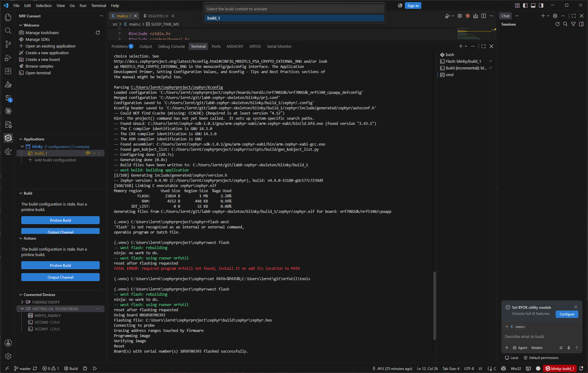
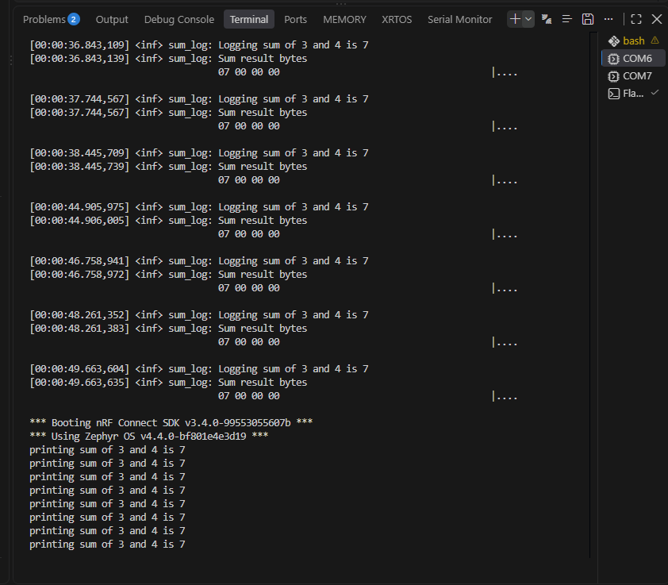
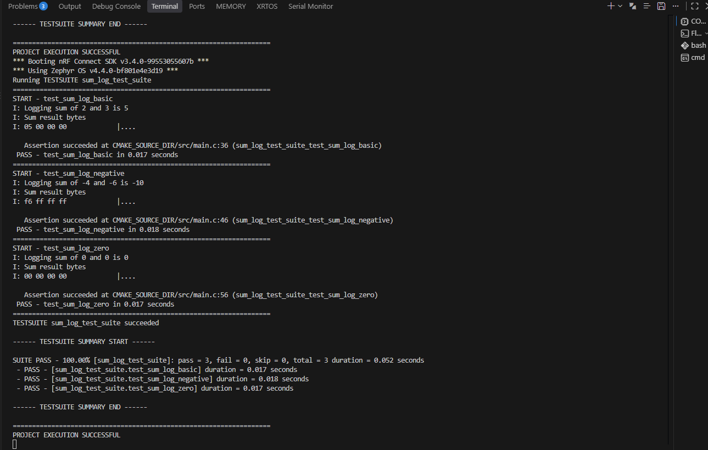
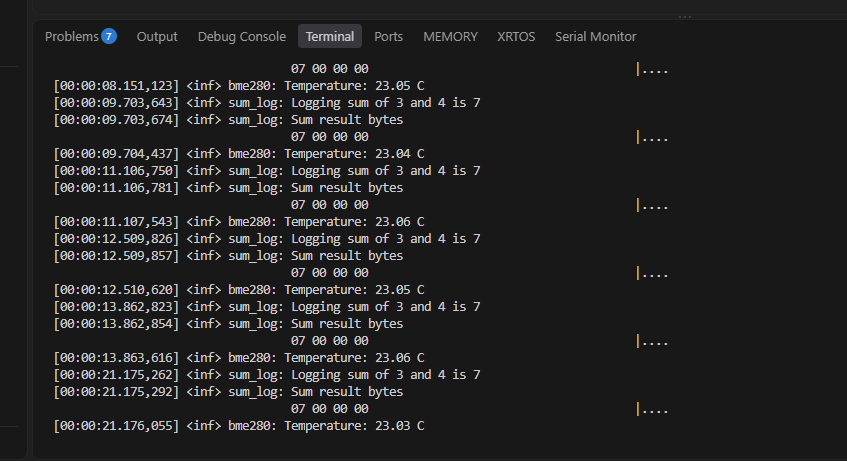
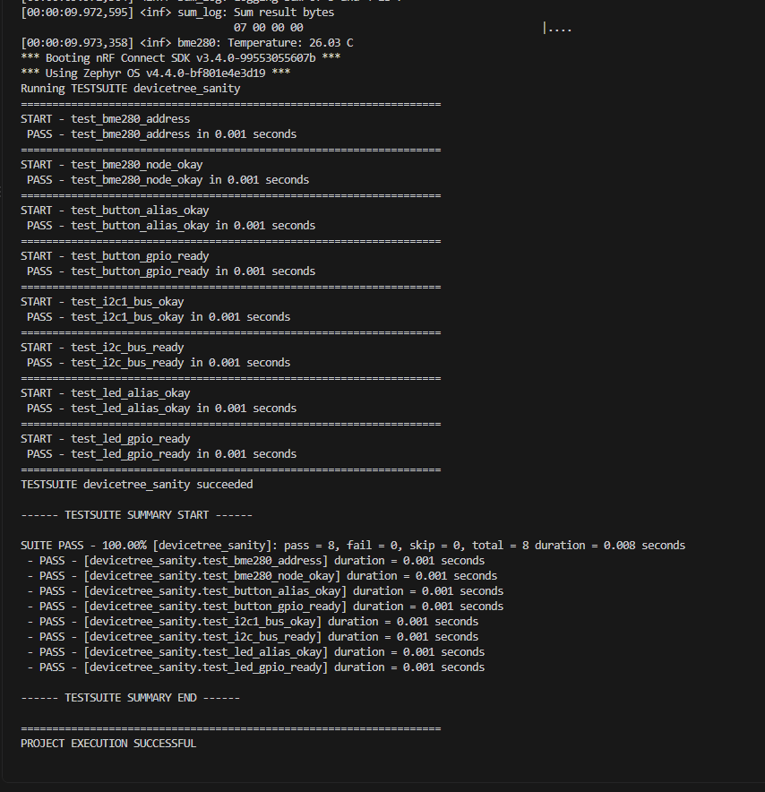

# ESE5180: Lab 0 Zephyr

| Team Member Name | Email Address       |
|------------------|---------------------|
| Alexander Yu      | ayu2126@engineering.upenn.edu |          |

**GitHub Repository URL: https://github.com/lerntuspel/Lab_0-F26_Zephyr.git** 

## 1. Hello (Vanilla) Zephyr

Done

## 2. Hello (Nordic) Zephyr

in commit hash ef7803644fee5784c8a5d0dab9a02888ec5e0b12

## 3. Building with West

3.1

## 4. Kconfig

I skimmed the reading

## 5. Device Tree (DT)

### 5.1
Also on commit hash ef7803644fee5784c8a5d0dab9a02888ec5e0b12

### 5.2 & 5.3
Commit hash 06138731ccd2648a9acc08f472f124b2646a6457

Why create an overlay if you can edit the dts?
The DTS is shared among all devices, the overlay maps the device tree to the specific device you are building for.

## 6. Printing vs. Logging

### 6.1

### 6.2

Done

### 6.3

Commit hash 17c0f905430f851943e7426fb4c99ab341412981

## 7. Ztest for Unit Testing

### 7.1

Commit hash 11a42670ef06a59590a6dd109853fdd0e120f338

### 7.2

## 8. Adding a Peripheral (BME280)

### 8.1 

### 8.2

